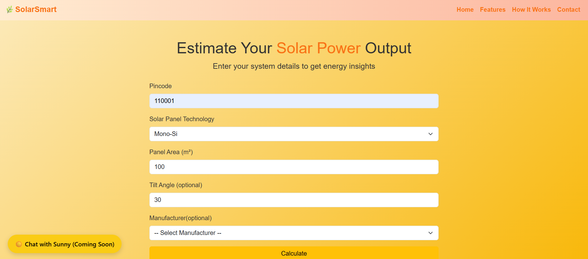

# SolarSmart: Smart Solar Output Estimation System

_Developed for HACKORBIT 2025 — Solar Energy Optimization Track_

**SolarSmart** is a data-driven web application that estimates solar panel energy generation based on real-time weather data, selected technology, manufacturer, area, and optional tilt angle. It uses machine learning models trained on real-world datasets and live weather input from the NASA POWER API to provide accurate energy forecasts and estimated financial savings.

---

## Why SolarSmart?

India has vast untapped solar potential, but most users lack accessible tools to evaluate how much energy they could generate or save. SolarSmart addresses this gap by providing personalized, real-time solar output predictions using weather data and machine learning.

---

## Features

- Input location using pincode and fetch live weather from NASA POWER
- Select solar panel technology and manufacturer (optional)
- Predict energy output using a trained machine learning model
- View real-time estimates for current power, daily, monthly, and yearly energy generation
- Interactive charts showing historical performance and short-term forecasts
- Ongoing development of a chatbot assistant for user interaction

---

## Tech Stack

- **Frontend**: HTML, CSS (Bootstrap), JavaScript, Chart.js
- **Backend**: Flask
- **Machine Learning**: Random Forest Regressor (trained using scikit-learn)
- **APIs**: NASA POWER API, OpenStreetMap (for geolocation)
- **Chatbot (in progress)**: Langchain, LLMs, RetrievalQA

---

## How It Works

1. **User Input**:
   - Pincode (for weather data retrieval)
   - Solar panel technology
   - Panel area (in square meters)
   - Optional: tilt angle and manufacturer

2. **Prediction Process**:
   - Live hourly data (GHI, temperature, wind speed) is fetched using NASA POWER
   - The model predicts power output per square meter
   - The system calculates daily, monthly, and yearly estimates along with estimated cost savings

3. **Visualization**:
   - Charts display:
     - Power generation over the last 30 days
     - Forecast for the next 10 days

---

## Demo Screenshots

### Input Page


### Results Page


---

## Datasets Used

The model is trained on more than 15 combined datasets, including:
- Actual solar power generation (`Power(MW)`)
- Corresponding weather data

**Folder**: `Datasets/`  
**Example files**:
- `Actual_UPV_Hourly_30.45_-88.25_2006.csv`
- `*_weather.csv`

**Sources**: Public datasets from NREL and NASA POWER

---

## Setup Instructions

### 1. Clone the Repository
```bash
git clone https://github.com/your-username/SolarSmart.git
cd SolarSmart
```

### 2. Install Dependencies
```bash
pip install -r requirements.txt
```

### 3. Train the Model
Before running predictions, you need to train the model using:
```bash
python main.py
```

This will generate the following files:
- `trained_model.pkl`
- `scaler.pkl`

### 4. Start the Flask Server
```bash
python app.py
```

Then open your browser and navigate to:
[http://127.0.0.1:5000](http://127.0.0.1:5000)

---

## Submission Notes

This project is submitted as a working prototype for HACKORBIT 2025. Core functionalities include:

- Dataset ingestion and preprocessing
- Real-time solar prediction using live weather inputs
- Full-stack integration of machine learning with Flask backend
- Visual output through charts and responsive UI

Chatbot integration is currently in progress and partially functional.

---

## Authors — Team We Bare Bugs

- **Sarvesh Sapkal** — Backend development, machine learning model training
- **Shalvi Maheshwari** — Chatbot integration, backend-frontend integration
- **Laukika Shinde** — Frontend design, data processing

---

## License

This project is intended for academic and research use.

---

## 🤖 Chatbot Setup Summary

The chatbot in this project is designed to assist users with queries related to solar power prediction by referencing a custom knowledge base.

### ✅ What We Did

- Developed the main chatbot logic in `chatbot.py`, integrating with a local knowledge base containing relevant documentation.
- Utilized Langchain for prompt handling, retrieval-based QA, and memory management.
- Embedded documents using HuggingFace embeddings and stored them in a ChromaDB vector store for fast semantic search.
- Configured Flask with Flask-CORS to serve the chatbot API and enable frontend communication.

### 📦 Note on Dependencies

Due to GitHub’s file size limitations, we have not committed the full set of dependencies (which exceed 100 MB) to the repository. To run the chatbot locally, please ensure the following:

1. Create a virtual environment:
   ```bash
   python -m venv venv
   source venv/bin/activate  # or venv\Scripts\activate on Windows
   ```

2. Install required packages manually using:
   ```bash
   pip install -r requirements.txt
   ```

Make sure you have GPU/CPU capacity and RAM to run embeddings locally.
